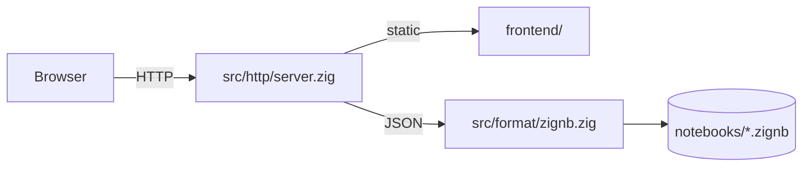

# ZNotebook Execution Engine Architecture

This document describes the compilation and execution model of ZNotebook.

> **Current:** The native Zig server handles HTTP, UI, `.zignb` I/O, and cell execution via `/api/run`.

---

## 1. Project Layout (Zig Native)

```text
src/
├── main.zig           # std.process.Init → server
├── config.zig         # port, paths, .zignb
├── assets.zig         # load frontend/ at startup
├── http/              # TCP + HTTP parse/respond
├── api/router.zig     # route dispatch
├── format/zignb.zig   # notebook file I/O
└── engine/            # parser, codegen, executor, /api/run

lib/notebook.zig       # printHtml, printTable, plotLine (Zig 0.16 Io)
```

---

## 2. Cell Parsing and Code Generation

Zig has no top-level statements. The backend splits each code cell into:

| Kind | Examples | Scope in generated file |
|------|----------|-------------------------|
| **Declaration** | `fn`, `struct`, `@import`, `const Type = struct` | Global module scope |
| **Statement** | `std.debug.print`, assignments, control flow | Inside `pub fn main()` |

When cell `C_k` runs, cells `C_0 … C_k` are merged. Declarations deduplicate by name (latest wins).

Generated structure:

```zig
const std = @import("std");
// optional: const nb = @import("notebook");

// Global declarations (sorted keys for cache stability)
// ...

pub fn main(init: std.process.Init) !void {
    const io = init.io;
    nb.initOutput(io);
    // [ZNB_CELL_START:cell-id] markers
    // statements for cell 0..k
}
```

---

## 3. Zig 0.16 I/O Migration (Phase 0)

Zig 0.16 removed `std.io`. ZNotebook uses:

| Old (broken) | New (0.16) |
|--------------|------------|
| `std.io.getStdOut().writer()` | `Io.File.stdout().writer(io, &buf)` |
| `std.net` | `std.Io.net` |
| `std.process.Child` | `std.process.spawn(io, …)` |
| `std.fs.cwd()` | `std.Io.Dir.cwd()` |

`lib/notebook.zig` exposes `initOutput(io)` so generated `main` can wire stdout before helper calls.

---

## 4. `.zignb` File Format

```json
{
  "format": "zignb",
  "format_version": 1,
  "name": "hello",
  "cells": [
    {
      "id": "cell-1",
      "type": "code" | "markdown",
      "source": "...",
      "execution_count": null,
      "outputs": []
    }
  ]
}
```

- **Save:** always `notebooks/{name}.zignb`
- **Load:** tries `.zignb` first, then legacy `.znb`

---

## 5. HTTP API

| Endpoint | Status |
|----------|--------|
| `GET /api/notebooks` | List `*.zignb` |
| `GET /api/notebook/{name}` | Load JSON |
| `POST /api/save` | Write `.zignb` |
| `POST /api/run` | Execute cells via `zig run` |

---

## 6. Error Mapping

1. Build source map while generating `temp/notebook_*.zig`
2. Parse Zig errors: `notebook_name.zig:line:col: error: …`
3. Map to `{ cell_idx, cell_line, col, message }`
4. Frontend draws Monaco squiggles

---

## 7. Rich Output Protocol

| Prefix | Frontend render |
|--------|-----------------|
| `[ZNB_HTML]` | HTML block |
| `[ZNB_IMAGE]` | SVG or base64 image |
| `[ZNB_MD]` | Markdown HTML |
| (plain text) | Console `<pre>` |

Implemented in `lib/notebook.zig`; parsed in `frontend/app.js`.

---

## 8. Caching Strategy (Phase 3)

- Run `zig run` from `temp/` with fixed `.zig-cache`
- Sort declaration keys deterministically before codegen
- Hash declaration section to skip rewriting unchanged globals

---

## 9. Server Flow (Phase 1)



Phase 2 adds: `codegen → zig run → stdout/stderr → Browser`.
