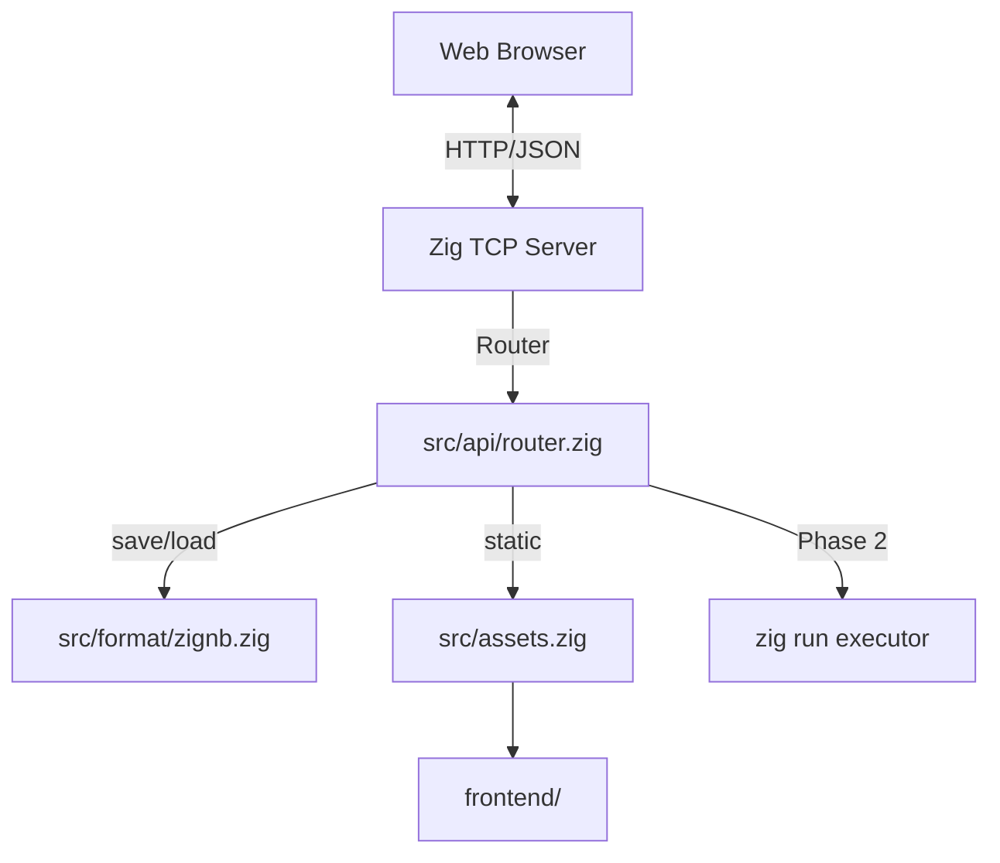

# Native Zig Backend Architecture

ZNotebook is implemented as a **pure Zig** binary (`znotebook`). This document describes the current architecture after Phase 0 + 1.

---

## Core Architecture



---

## Entry Point

```zig
pub fn main(init: std.process.Init) !void {
    const io = init.io;
    const gpa = init.gpa;
    try server.serve(io, gpa);
}
```

Uses Zig 0.16's `std.process.Init` for I/O, allocator, and environment.

---

## HTTP Server

- **Listen:** `std.Io.net.IpAddress.parseLiteral("127.0.0.1:8000")`
- **Accept loop:** single-threaded, one request at a time
- **Parse:** minimal HTTP/1.1 in `src/http/request.zig`
- **Respond:** `src/http/response.zig`

Frontend files load from `frontend/` at startup into memory.

---

## Notebook I/O

`src/format/zignb.zig`:

- `listNotebooks` — scan `notebooks/*.zignb` (and legacy `.znb`)
- `loadNotebook` — read file into JSON response
- `saveNotebook` — write `notebooks/{name}.zignb`
- `sanitizeName` — alphanumeric + `_` + `-` only

---

## Rich Output Library

`lib/notebook.zig` — user-facing helpers updated for **Zig 0.16**:

```zig
pub fn initOutput(io_instance: Io) void;
pub fn printHtml(html: []const u8) void;
pub fn printMarkdown(md: []const u8) void;
pub fn printTable(headers: []const []const u8, rows: []const []const []const u8) void;
pub fn plotLine(title: []const u8, x: []const f64, y: []const f64) !void;
```

Generated notebooks (Phase 2) call `initOutput` before cell statements.

---

## Build & Run

```powershell
zig build          # → zig-out/bin/znotebook.exe
zig build run      # start server
zig build test     # unit tests
```

---

## Phase 2 Additions

The following modules will be added under `src/`:

| Module | Role |
|--------|------|
| `parser.zig` | Brace-aware cell block splitter |
| `codegen.zig` | Generate `temp/notebook_*.zig` |
| `executor.zig` | `std.process.spawn` → `zig run` |

See `doc/roadmap.md` for the full timeline.

---

## Deprecated: Rust Backend

The previous Rust implementation has been **removed**. ZNotebook is Zig-only.
